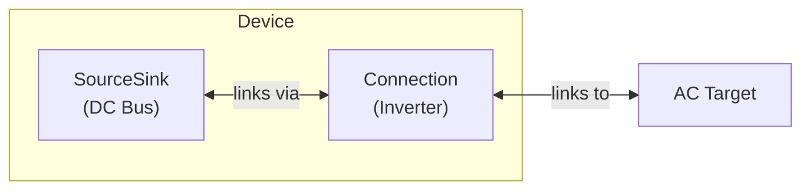

# Inverter Modeling

The Inverter device models a DC bus coupled to an AC connection. This replaces the need for manual node/connection configuration for inverters by providing a high-level device that creates both the DC bus (as a SourceSink) and the inverter connection to the AC network.

## Model Elements Created

| Model Element                               | Name                | Parameters From Configuration                                |
| ------------------------------------------- | ------------------- | ------------------------------------------------------------ |
| [SourceSink](../model-layer/source-sink.md) | `{name}`            | is_source=false, is_sink=false                               |
| [Connection](../model-layer/connection.md)  | `{name}:connection` | max_power, efficiency (export/import directions from config) |

## Devices Created

Inverter creates 1 device in Home Assistant:

| Device  | Name     | Created When | Purpose             |
| ------- | -------- | ------------ | ------------------- |
| Primary | `{name}` | Always       | Inverter management |

## Parameter Mapping

The adapter transforms user configuration into model parameters:

| User Configuration  | Model Element | Model Parameter            | Notes                    |
| ------------------- | ------------- | -------------------------- | ------------------------ |
| `connection`        | Connection    | `target`                   | AC connection target     |
| `max_power_export`  | Connection    | `max_power_source_target`  | DC to AC (export) limit  |
| `max_power_import`  | Connection    | `max_power_target_source`  | AC to DC (import) limit  |
| `efficiency_export` | Connection    | `efficiency_source_target` | DC to AC conversion loss |
| `efficiency_import` | Connection    | `efficiency_target_source` | AC to DC conversion loss |

## Sensors Created

### Inverter Device

| Sensor                   | Unit  | Update    | Description                            |
| ------------------------ | ----- | --------- | -------------------------------------- |
| `power_export`           | kW    | Real-time | Power flow from DC to AC               |
| `power_import`           | kW    | Real-time | Power flow from AC to DC               |
| `power_active`           | kW    | Real-time | Net power (export - import)            |
| `power_max_export`       | kW    | Real-time | Configured max export power (if set)   |
| `power_max_import`       | kW    | Real-time | Configured max import power (if set)   |
| `power_max_export_price` | \$/kW | Real-time | Shadow price for export limit (if set) |
| `power_max_import_price` | \$/kW | Real-time | Shadow price for import limit (if set) |
| `dc_bus_power_balance`   | \$/kW | Real-time | Shadow price of power at the DC bus    |

## Configuration Examples

### Basic Inverter

| Field                | Value    |
| -------------------- | -------- |
| **Name**             | Inverter |
| **Connection**       | network  |
| **Max Power Export** | 10.0     |
| **Max Power Import** | 10.0     |

### Inverter with Efficiency

| Field                 | Value    |
| --------------------- | -------- |
| **Name**              | Inverter |
| **Connection**        | network  |
| **Max Power Export**  | 10.0     |
| **Max Power Import**  | 10.0     |
| **Efficiency Export** | 0.97     |
| **Efficiency Import** | 0.96     |

## Typical Use Cases

**DC-Coupled Battery Systems**:
Connect DC-coupled batteries and solar panels to the DC bus side of the inverter, with the AC side connecting to the grid/network.

**Hybrid Solar Systems**:
Systems where solar panels connect to the DC bus along with batteries, sharing a single inverter for grid connection.

**Asymmetric Power Ratings**:
Inverters that have different ratings for charging vs discharging (e.g., 5kW charge, 10kW discharge).

## Physical Interpretation

The Inverter represents a bidirectional DC/AC power converter with its associated DC bus. The DC bus acts as a junction point where DC-coupled devices (batteries, solar) connect, while the inverter connection handles conversion to/from the AC network.

### Configuration Guidelines

- **Efficiency Matters**: Even small efficiency differences (97% vs 100%) significantly affect optimal battery dispatch strategies.
- **Asymmetric Limits**: Many inverters have different power limits for charging vs discharging—use `max_power_import` and `max_power_export` to model this.
- **DC Bus Connections**: DC-coupled batteries and solar should specify the inverter's name as their `connection` target.
- **AC Network**: The inverter's `connection` field typically points to `network` (the main AC bus).

## Next Steps

- :material-power-plug:{ .lg .middle } **SourceSink model**

    ---

    Underlying model element for the DC bus.

    [:material-arrow-right: SourceSink formulation](../model-layer/source-sink.md)

- :material-connection:{ .lg .middle } **Connection model**

    ---

    Underlying model element for the inverter.

    [:material-arrow-right: Connection formulation](../model-layer/connection.md)

- :material-battery:{ .lg .middle } **Battery element**

    ---

    Connect batteries to the DC bus.

    [:material-arrow-right: Battery modeling](battery.md)

